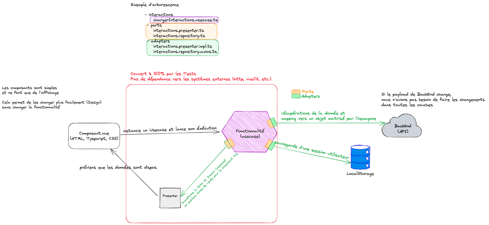

## Introduction

Accompagner les citoyens dans leur transition écologique, en leur proposant des informations, solutions adaptées à leur
situation personnelle et leurs intérêts, et en rendant accessibles l’ensemble des aides à leur disposition

## Pile Technique

- VueJS 3
- Vitest
- Playwright
- [DSFR](https://www.systeme-de-design.gouv.fr/)

## Démarrage

```bash
$ yarn install
```

```bash
$ yarn dev
```

## Commandes utiles

- `$ yarn test` : lance les tests unitaires
- `$ yarn test:e2e` : lance les tests end to end avec playwright

## Architecture

L'architecture logicielle de ce projet repose sur une architecture Ports/Adapters.
Le principe est d'isoler la valeur métier du front, et de pouvoir s'abstraire de tous frameworks et technologies.


## Mise à jour des dépendances

La CI se charge elle-même de mettre à jour les dépendances via Dependabot.
En général, les MR sont créées automatiquement dans la nuit du lundi au mardi (_dependabot.yml)_.

## Déploiement

Le déploiement est automatisé via la CI/CD sur la plateforme d'hébergement [Scalingo](https://dashboard.scalingo.com/).
A chaque push sur la branche main, un nouveau déploiement est déclenché sur l'environnement de dev.
Pour la production, c'est le job release-please qui se charge de faire le déploiement.
Mode opératoire :

- Merge la MR de type `chore(main): release x.y.z` (générée par release-please)
- Lancer le job `mise-en-production` dans la CI/CD en choisissant le tag correspondant à la MR mergeée
- Le job se charge de faire le déploiement en production

Attention : les Github Actions nécessitent un token
Scalingo ([API Token](https://dashboard.scalingo.com/account/tokens)) qu'il faut mettre dans
les [secrets du dépôt](https://github.com/betagouv/agir-front/settings/secrets/actions).

## Tracking et Analytics

Le projet utilise Matomo pour le tracking et l'analytics.
Le projet utilise Sentry pour le suivi des erreurs en production et développement.

## Conformité du code

Les commits et les noms de MR suivent la convention [Conventional Commits](https://www.conventionalcommits.org/en/v1.0.0/).
Les noms de branches sont précédés par (_tech_, _feature_ ou _fix_)

Le projet utilise Husky pour vérifier la conformité du code (_linting et typescript / vue check_) avant chaque commit.
Un hook pre-push est également mis en place pour vérifier que les noms de branches sont conformes.
